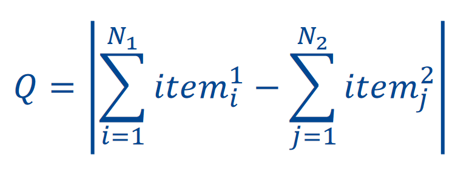
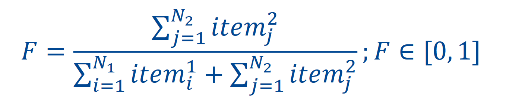

# Balanced Parition

## Hyper heuristic calculation

1. Make the hyper heuristic matrix
2. Calculate the feature values for your set of items for each rule in the matrix
3. Get the eucledian distance for each feature for each rule in the matrix
4. Activate the rule with the smallest abs(distance)
5. Repeat for each iteration of the problem (remaining item in the list)

## Balanced Partition Problem

**Problem:** distribute a set of tasks or items in 2 subsets, minimising the difference between them:

1. Start with all elements assigned to one subset.
2. Pass elements to the other subset until they're half or more.

### Features

1. Ratio of bin we're filling and max load:

### Heuristics

1. **Max**: select element with greatest weight
2. **Min**: select element with minimum weight

