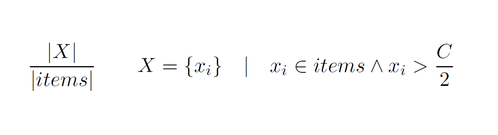

# Bin Packing

## Hyper heuristic calculation

For each instance of the problem we want the best combination of the available heuristics.

1. Make the hyper heuristic matrix
2. Calculate the feature values for your set of items for each rule in the matrix
3. Get the eucledian distance for each feature for each rule in the matrix
4. Activate the rule with the smallest abs(distance)
5. Repeat for each iteration of the problem (remaining item in the list)

## Bin Packing Problem

**Problem:** Given a set of items, place them in the smallest number of bins where each bin has a max capacity.

**Optionally**, minimize the average waste:

Where

- `n` is the total number of bins
- `Q` is the average waste
- `C` is the max capacity of the bins (*assuming this is a fixed value for all bins*)
- Wj is the current weight of bin `j`

### Features

For the bin packing problem we can use the following features of the **remaining elements**:

1. Average weight (length) of elements
2. Standard deviation of elems
3. Relation of the elements whose weight (length) is greater than half the max capacity of the bins.

The third one can be expressed mathematically as: 

where 

- `n` is the total number of bins
- `C` is the max capacity of the bins
- `items` is the set of remaining items
- `||` denotes the cardinality (number of items) of the set

### Heuristics: 

For the bin packing problem, we can use the following heuristics:

1. **First fit** (`FF`): first bin where the element fits
2. **Best fit** (`BF`): best fit for the element (**least available space**)
3. **Worst fit** (`WF`): worst fit for the element (**greatest available space**)
4. **Almost worst fit** (`AWF`): next to last worst fit for the element

