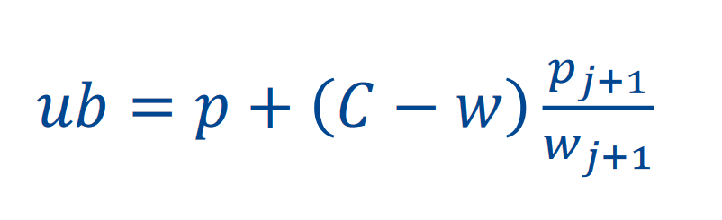

# Knapsack

## 1/0 knapsack

- single bag with max weight C
- set of items with weight wi and profit pi
- **Objective:** find subset of elements that give max profit without exceeding max weight

## Branch & Bound Solution

1. Organise elements in descending order by their `profit/weight` ratio.
2. Define a max expected profit.

#### Heuristic

One way to estimate the max expected profit is to assume that the rest of the space will be filled by the best `profit/weight` ratio:

